## Run

Composer install

## Add This Lines To Your .env File
For Gmail api
First create a project on Google Developer Console. Then add values to your .env 
```
GOOGLE_PROJECT_ID=
GOOGLE_CLIENT_ID=
GOOGLE_CLIENT_SECRET=
GOOGLE_REDIRECT_URI=
GOOGLE_ALLOW_MULTIPLE_CREDENTIALS=
GOOGLE_ALLOW_JSON_ENCRYPT=
```

For Outlook

```
OAUTH_APP_ID=
OAUTH_APP_SECRET=
OAUTH_REDIRECT_URI=
OAUTH_SCOPES='openid profile offline_access user.read Mail.Read Mail.ReadBasic Mail.ReadWrite'
OAUTH_AUTHORITY=https://login.microsoftonline.com/common
OAUTH_AUTHORIZE_ENDPOINT=/oauth2/v2.0/authorize
OAUTH_TOKEN_ENDPOINT=/oauth2/v2.0/token
GRANT_TYPE=refresh_token
```
# Screenshots for outlook
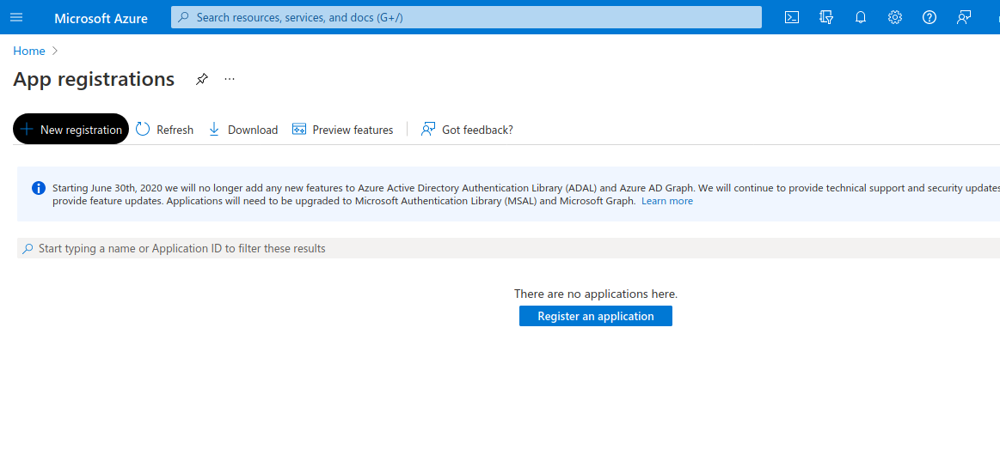
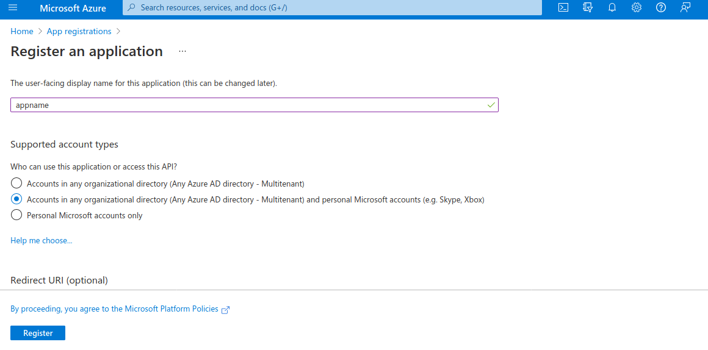
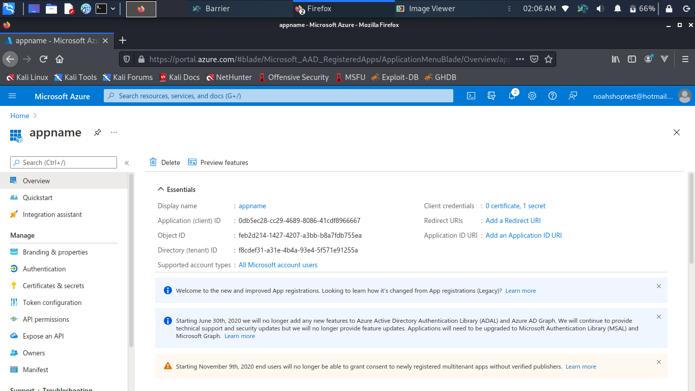
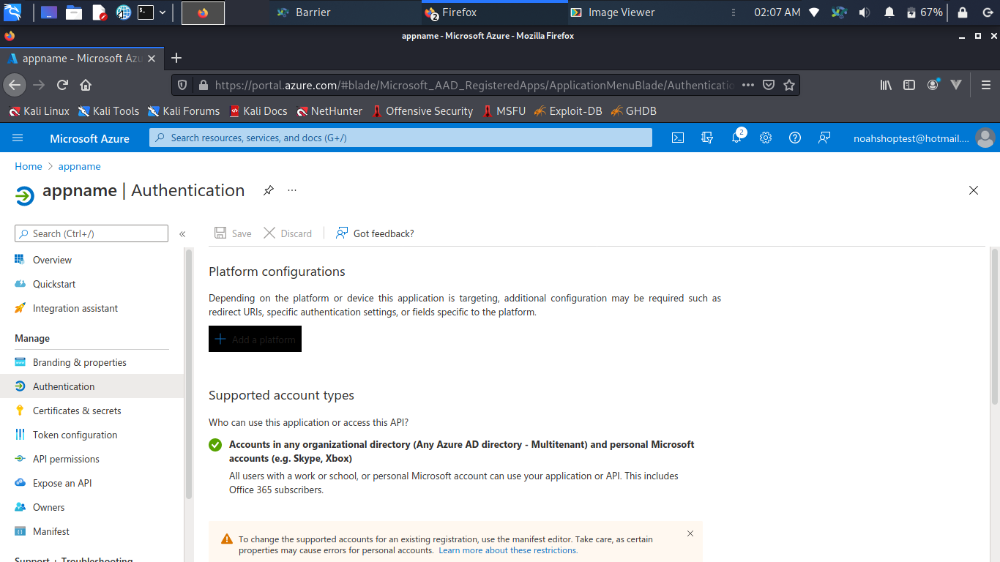
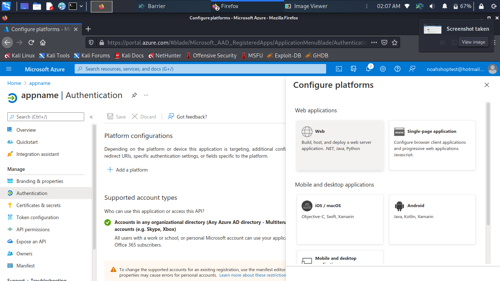
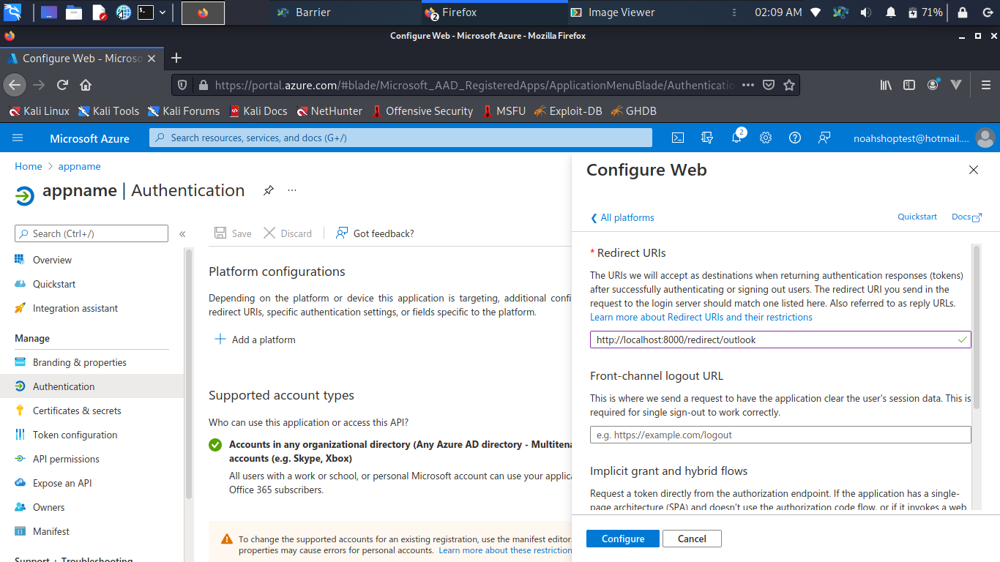
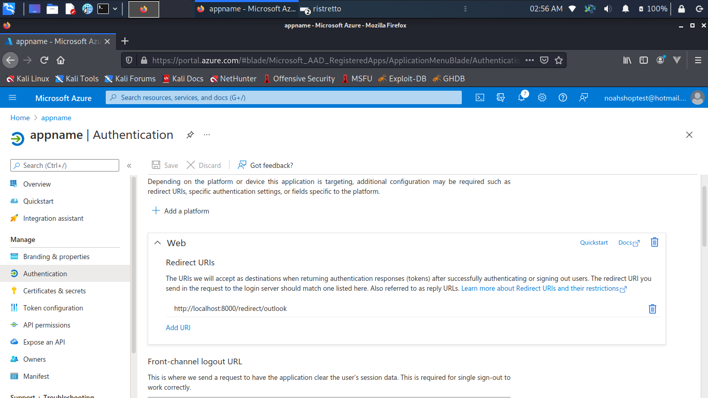
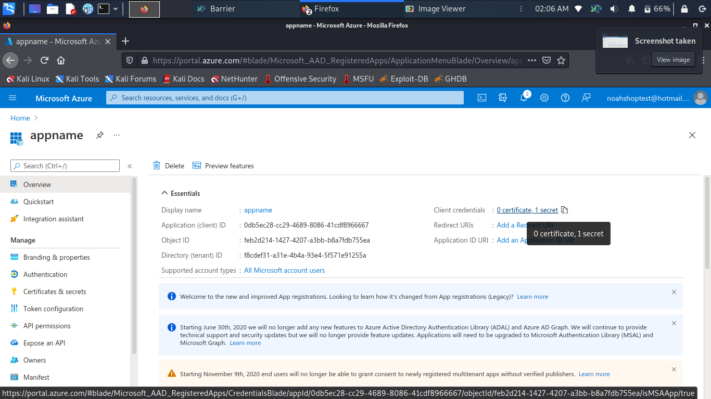
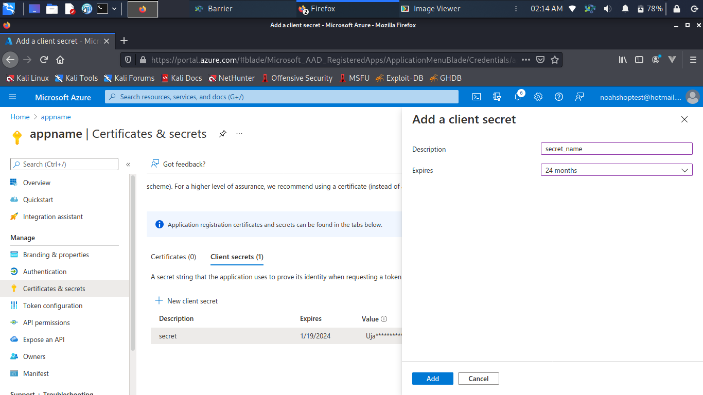
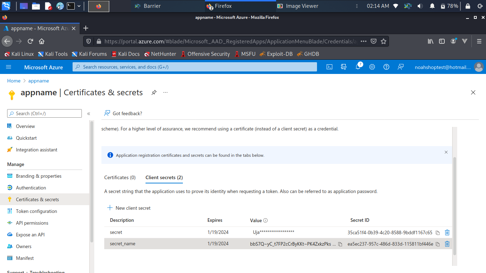
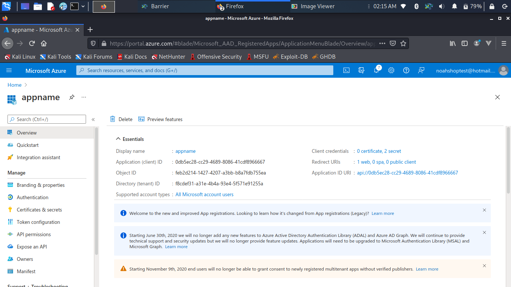


## Routes

1) To verify your email and get access token
```  
api/verify-email 
```

2) To get your unread messages 
```  
api/emails
```

## Vendors emails

All vendors emails list can be access from inside .env file.
You can add multiple emails for one vendor and multiple vendors.

### List of Vendors and emails 

```
AMAZON_EMAILS=info@amazon.de
BASLERBEAUTY_EMAILS=info@basler-beauty.de
BESTSECRET_EMAILS=service@bestsecret.com
DEINEGROUPON_EMAILS=orders@r.grouponmail.de
IDEALOFSWEDEN_EMAILS=noreply@idealofsweden.com
LONASHA_EMAILS=kontakt@lashona.de
RENO_EMAILS=noreply@shop.reno.de
```